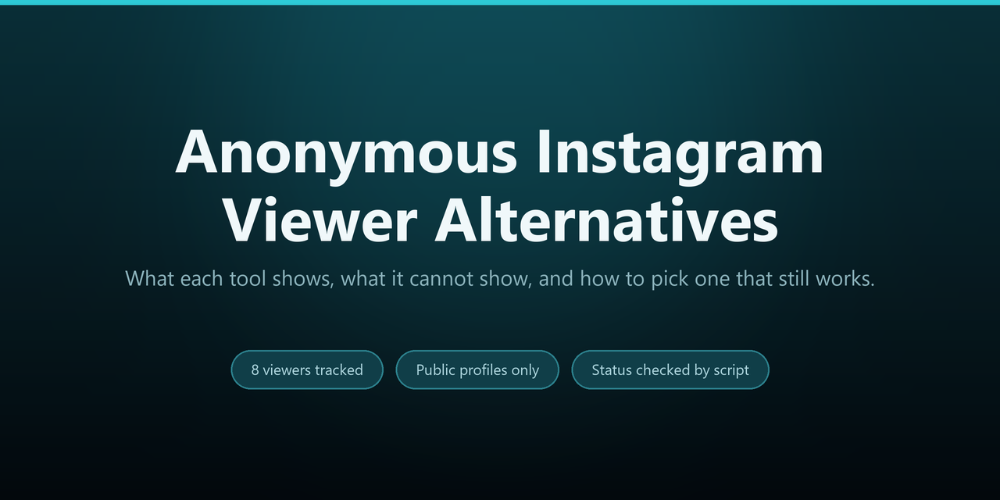
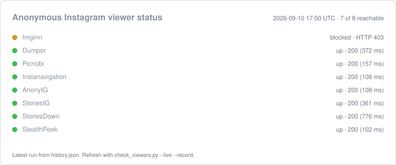

# Anonymous Instagram Viewer Alternatives

Anonymous Instagram viewer alternatives, compared: what each tool shows, what it cannot show, and how to pick one that still works.



## What's in this repository

| File | Purpose |
| --- | --- |
| `README.md` | This article |
| `viewers.json` | The directory of viewers as machine-readable data |
| `check_viewers.py` | Reports which viewers are still reachable, and can log each run |
| `picker.py` | Picks a viewer from the directory for the job you have |
| `validate.py` | Checks `viewers.json` for missing fields, bad URLs, and duplicates |
| `status_svg.py` | Renders the latest recorded run as `status.svg` |
| `history.json` | One recorded row per check run |
| `status.svg` | Status card rendered from `history.json` |
| `preview.png` | Social preview image |
| `LICENSE` | MIT license |

Every script here uses the Python standard library only, so there is nothing to install beyond Python 3 itself.

## Table of contents

- [What an anonymous Instagram viewer is](#what-an-anonymous-instagram-viewer-is)
- [The three kinds of tool in this list](#the-three-kinds-of-tool-in-this-list)
- [What no viewer can do](#what-no-viewer-can-do)
- [Why a list of alternatives](#why-a-list-of-alternatives)
- [The alternatives](#the-alternatives)
- [Current status](#current-status)
- [How to check which ones still work](#how-to-check-which-ones-still-work)
- [Which one should I use](#which-one-should-i-use)
- [Keeping the directory valid](#keeping-the-directory-valid)
- [Adding a viewer to the directory](#adding-a-viewer-to-the-directory)
- [How to evaluate a viewer](#how-to-evaluate-a-viewer)
- [Full reviews](#full-reviews)
- [Frequently asked questions](#frequently-asked-questions)
- [Disclaimer](#disclaimer)

## What an anonymous Instagram viewer is

An anonymous Instagram viewer is a web tool that shows public Instagram content without a login and without the visit being tied to you. You enter a username, the tool fetches the account's public posts and stories through its own servers, and you read them in your browser. The most common use is an Instagram story viewer: to watch a public story without the account owner knowing.

These tools work with public profiles only. None of them can view a private account, and a tool that claims otherwise is not what it says it is.

## The three kinds of tool in this list

The entries are not interchangeable, and the `supports` tags in `viewers.json` record which is which. Three kinds show up here:

- **Story viewers.** The largest group. You enter a username and read the current stories and saved highlights, with nothing logged against your own account.
- **Profile and post viewers.** These show the grid instead: posts, reels, bio, and follower counts. A couple add search by hashtag or location, which is how you find a public account rather than looking one up by name.
- **Downloaders.** The same public content, saved to your device rather than read in the browser. Some do this alongside viewing, others do only this.

Most entries cover two of the three, which is why the directory carries tags at all. It is also why `picker.py` filters on them: eight names in a list is not the same thing as eight interchangeable options.

## What no viewer can do

The limits are the same for every tool here, whatever the landing page claims:

- **View a private account.** Private content is visible to approved followers only, and no web tool changes that. A tool promising private access is not doing what it says it does.
- **Tell you who viewed a profile.** Instagram does not publish profile visitors, so there is no record for a tool to read. Nothing can recover what was never stored.
- **Reveal a private email, phone number, or address.** That information is not on a public profile in the first place.
- **Recover deleted content.** Once a post or story is gone it is gone. A viewer shows only what Instagram is serving at that moment.

The pattern is the same every time: a viewer can only show what Instagram already exposes publicly. Anything beyond that would take access no third-party tool has.

## Why a list of alternatives

This niche turns over fast. Instagram changes its public endpoints often, and a viewer stops working the moment its fetching method breaks. A tool that worked last month can be gone today, and the site you relied on can move to a new domain overnight.

That is why you keep more than one viewer in mind. The list below covers the names you are most likely to run into, and the checker in this repository tells you which of them are reachable right now.

The churn is not hypothetical. Several entries in this directory have already been repointed once, after the domain in circulation lapsed and the tool came back under a different extension.

## The alternatives

The tools this directory tracks: Imginn, Dumpor, Picnobi, Instanavigation, AnonyIG, StoriesIG, StoriesDown, and StealthPeek. They overlap heavily. Most show public posts, stories, and reels without a login, and a few add extras such as hashtag or location search.

## Current status



That card is rendered from `history.json`, the log of check runs. It shows the most recent run, and the dot on each row is the honest reading of it:

- **Green** means the site answered. It is up.
- **Amber** means the site answered but refused the automated request with an HTTP 403. The site is up and blocking bots, which is normal for a viewer and not a sign that it is dead.
- **Red** means no response at all. The domain is gone or its DNS is broken, so that entry is the one to replace first.

A card that stays red for an entry across several runs is the clearest signal this list gives you: that tool has left the field.

## How to check which ones still work

`check_viewers.py` reads `viewers.json` and fetches each viewer's homepage, then reports what is reachable right now. It hits the viewer's own site only, never Instagram.

```
python check_viewers.py              # list the directory, no network
python check_viewers.py --live       # check each site and report up or down
python check_viewers.py --markdown   # print a markdown table
python check_viewers.py --live --record   # also append this run to history.json
```

A result of `up` means the site responded. A `down HTTP 403` usually means the site is up but blocking automated requests, not that it is down. `timeout` or `unreachable` means the domain is gone or the site is down, which is your cue to try the next one.

Add `--record` to keep a timeline, then render it as the card above. One run is a snapshot, but a few weeks of runs show which tools fail repeatedly and which ones recover.

```
python check_viewers.py --live --record
python status_svg.py
```

## Which one should I use

The directory tags every viewer with what it supports, and `picker.py` filters on those tags, so you can ask for the job you have instead of reading the whole list. It reads `viewers.json` only and never touches the network, so it works offline and returns instantly.

```
python picker.py                        # asks what you need
python picker.py --need stories         # entries that do one thing
python picker.py --need stories,reels   # entries that do all of them
python picker.py --need stories --any   # entries that do any of them
python picker.py --list                 # every viewer and its tags
```

By default every tag you ask for has to match, because that is the question people actually have: which tools will show me stories and reels, not which will show me stories or reels. Pass `--any` when you will settle for a partial match. The results come back broadest first, and each pick is followed by its URL.

Run `check_viewers.py --live` afterwards to see which of the picks are reachable right now, since the picker is deliberately offline and cannot know that on its own.

## Keeping the directory valid

`viewers.json` is what every script here reads, so a typo in it breaks them quietly: a missing field becomes a crash, a malformed URL becomes a failed check, and a duplicate name hides a real entry. `validate.py` checks the file against the schema the other scripts expect and reports each problem by entry.

```
python validate.py                 # validate viewers.json
python validate.py other.json      # validate another file
```

It catches missing or empty fields, URLs that do not start with `http://` or `https://`, malformed or duplicated tags, and duplicate names or domains. Run it after you edit the data file to add a viewer. It exits non-zero when it finds a problem, so it also works as a pre-commit check or a CI step.

## Adding a viewer to the directory

The directory is one JSON file, so keeping it current is an edit rather than a fork:

1. Add an object to the `viewers` list in `viewers.json` with a `name`, a `url`, a one-line `note`, and `supports` tags.
2. Run `python validate.py` to check it against the schema the other scripts expect.
3. Confirm the site answers, then record the result:

```
python check_viewers.py --live --record
python status_svg.py
```

Keep the tags lowercase and reuse an existing tag wherever it fits, so `picker.py` keeps matching across entries instead of splitting one job across two names. If a tool is a mirror of one already listed, add it only when it behaves differently; otherwise the list grows without getting more useful.

## How to evaluate a viewer

When you compare these tools, apply the same checklist every time:

1. Public profiles only. A tool that will not say this plainly is hiding something.
2. No login or password needed. A real viewer uses its own session.
3. Nothing to install. A browser tool needs no app or extension.
4. It shows results for a public username immediately.
5. It is actively maintained. A viewer stays down until its method is updated.

A tool that passes all five is worth using. Most of the field fails one or two.

## Full reviews

The full, per-tool breakdowns live in the Discussions tab, one thread per viewer. Check there for the current state of a specific tool before you rely on it.

## Frequently asked questions

### Are anonymous Instagram viewers free?

Most are. The ones in this list run on ads, so they do not charge you. A viewer that asks for payment before showing anything is worth avoiding, because the free tools already do this job.

### Do these tools still work?

Some do and some do not, and the answer changes often. Instagram updates its public endpoints regularly, and each viewer stays up only until its own fetching method breaks. The checker in this repository reports the current state, and the Discussions track each tool over time.

### Can these tools view a private account?

No. Every honest viewer works with public profiles only, and no web tool can bypass a private account's privacy setting. A viewer that claims to unlock private accounts is not trustworthy.

### Is there one viewer that does everything?

No. There is no single winner here, and any tool claiming to be one is overselling. Keep two or three in mind, pick the one that is reachable today, and fall back to the next when it goes down. The checklist above is the fastest way to compare them, and `picker.py` does the filtering for you if you would rather ask by job than read the list.

### Do I need to install anything?

No. These are browser tools, so there is no app, extension, or download. The only install in this repository is optional, and it is Python 3 for the scripts, if you want to check status or filter the list yourself instead of reading it here.

### Is using one of these legal?

Browsing public content is generally allowed, but Instagram's terms restrict some third-party tools, and that changes by region. Use these for public profiles only, and do not scrape private data or repost other people's content.

## Disclaimer

This list is informational and is not affiliated with Instagram or Meta. Every tool here works with public profiles only. Respect Instagram's terms and the people whose content you browse.
